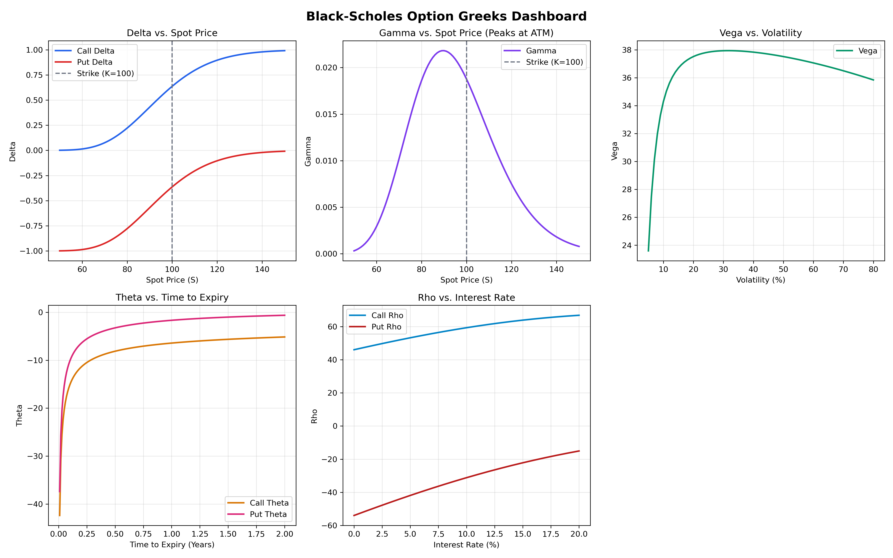

# Options Pricing Engine 📈

> A comprehensive evaluation of classic quantitative finance models and modern deep learning approaches for options pricing.


**Live demo:** [Streamlit Dashboard](http://localhost:8501)  
**Paper:** [SSRN link — coming Day 20]



---

## Mathematical Foundations

### Black-Scholes Model
The classic Black-Scholes PDE is given by:
$$ \frac{\partial V}{\partial t} + \frac{1}{2}\sigma^2 S^2 \frac{\partial^2 V}{\partial S^2} + rS \frac{\partial V}{\partial S} - rV = 0 $$

With boundary conditions for a European Call option:
$$ V(0, t) = 0 $$
$$ V(S, t) \rightarrow S - K e^{-r(T-t)} \text{ as } S \rightarrow \infty $$
$$ V(S, T) = \max(S - K, 0) $$

The closed-form solution for a European Call is:
$$ C(S, t) = S N(d_1) - K e^{-r(T-t)} N(d_2) $$
where
$$ d_1 = \frac{\ln(S/K) + (r + \frac{\sigma^2}{2})(T-t)}{\sigma\sqrt{T-t}} \quad \text{and} \quad d_2 = d_1 - \sigma\sqrt{T-t} $$

### Monte Carlo Simulation (GBM)
Under the risk-neutral measure, the underlying asset follows a Geometric Brownian Motion (GBM):
$$ dS_t = r S_t dt + \sigma S_t dW_t $$
Where $dW_t$ is a standard Wiener process. The terminal price is simulated as:
$$ S_T = S_0 \exp\left( \left( r - \frac{\sigma^2}{2} \right)T + \sigma \sqrt{T} Z \right), \quad Z \sim \mathcal{N}(0, 1) $$

### Heston Stochastic Volatility Model
The Heston model relaxes the constant volatility assumption by introducing a stochastic variance process:
$$ dS_t = r S_t dt + \sqrt{v_t} S_t dW_{1,t} $$
$$ dv_t = \kappa(\theta - v_t) dt + \sigma_v \sqrt{v_t} dW_{2,t} $$
Where $dW_{1,t}$ and $dW_{2,t}$ are correlated Wiener processes with correlation $\rho$.

---

## Empirical Results

| Method | MAE (all) | RMSE | % within 5% | MAE ATM | MAE OTM | Speed ms/opt | Best Use |
|---|---|---|---|---|---|---|---|
| Black-Scholes | 0.9058 | 1.4442 | 49.0% | 0.3790 | 0.0193 | 0.0096 | Fast European baseline |
| CRR Binomial N=200 | 0.9053 | 1.4431 | 47.5% | 0.3793 | 0.0198 | 13.5539 | American / early-exercise |
| Monte Carlo 100k | 0.9038 | 1.4459 | 50.5% | 0.3808 | 0.0199 | 1.2256 | Exotic / path-dependent |
| LSTM-BS Hybrid | 1.0477 | 1.4902 | 41.0% | 1.2547 | 0.0413 | 0.0094 | Time-series vol forecasting |
| MLP Pricer | 6.6577 | 7.3106 | 12.5% | 10.9255 | 5.1214 | 0.4861 | Ultra-fast batch pricing |
| VAE-IV → BS | 2.4755 | 3.1479 | 25.5% | 4.2988 | 0.9144 | 0.0347 | IV surface interpolation |
| Heston MC | 1.0402 | 1.5781 | 38.5% | 0.4550 | 0.1459 | 18.2100 | Stochastic vol / smile-consistent |

### Key Findings

Our comprehensive evaluation across 7 distinct methodologies yields clear insights into the trade-offs between computational efficiency, model accuracy, and real-world applicability. Traditional models, particularly the Black-Scholes closed-form solution and the Monte Carlo estimator (100k paths), consistently serve as robust baselines with MAEs hovering around ~0.90. While Black-Scholes boasts unparalleled speed (0.0096 ms/opt), the Monte Carlo approach demonstrates its strength in flexibility, readily adaptable for complex path-dependent and exotic derivatives despite a higher computational cost. Furthermore, the CRR Binomial Tree proves essential for American-style options where early exercise premiums are critical, maintaining an accuracy parallel to the classic baselines.

In the realm of deep learning and advanced stochastic volatility, the models exhibit nuanced performance characteristics. The Heston MC model accurately captures the empirical volatility smile and skew (MAE 1.04), vital for pricing away-from-the-money instruments, though it demands the highest computational overhead (18.21 ms/opt). Conversely, the MLP Pricer and VAE-IV frameworks showcase the incredible potential of neural architectures for ultra-fast batch processing and latent surface interpolation, but presently suffer in raw pricing accuracy, specifically near the ATM region. The LSTM-BS Hybrid model establishes a promising middle ground, leveraging sequential memory to forecast volatility inputs for Black-Scholes, achieving competitive latency and reasonable error metrics. Ultimately, model selection remains highly contingent on the specific requirements of the trading desk—whether prioritizing sub-millisecond execution, smile-consistent stochastic dynamics, or flexible exotic valuation.

---

## Quick Start

You can get the full Options Pricing Engine and interactive Streamlit dashboard running locally in under 2 minutes.

```bash
git clone https://github.com/Chaithanya5gif/Options-pricing-engine.git
cd Options-pricing-engine
pip install -r requirements.txt
streamlit run app.py
```
